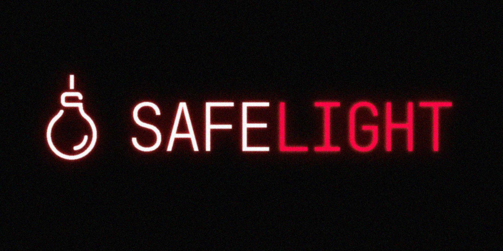

<p align="center">
  
</p>

<h1 align="center">Build your own darkroom</h1>

<p align="center"><strong>A fast, free, open-source RAW photo editor for Windows, Linux, macOS, and the browser, where every tool is yours to keep, move, or unplug.</strong></p>

## The mission

In a darkroom, the safelight is the one lamp you work by — dim, red, faithful — the single fixture the room can't live without. Everything else (the enlarger, the trays, the timer) you set down wherever you want it.

Safelight is that lamp: a small, steady core and nothing you didn't ask for. Every tool, every panel, every transform, even the ones that ship built in, is a piece you can move, swap, switch off, or invent. Open it and it simply works: clean defaults, gorgeous edits from the very first slider. Then you start arranging the room, and it becomes unmistakably *yours*.

- **Yours, forever.** Free and open source under the GPL. No subscription, no account, no expiry. The copy you install today is yours to keep, for good.
- **Private by default.** Everything happens on your machine. No telemetry, no cloud, no one looking over your shoulder. Your photos never leave the room, and exports carry no hidden metadata unless you put it there.
- **Lean by choice.** Carry only the tools you actually use; everything else stays out until you want it. No clutter, no weight you didn't choose.
- **Serious about images.** Real, full-resolution RAW and a 16-bit GPU pipeline under the hood. Free was never meant to mean basic.

> **Your workspace. Your rules.**

## Why everything is an extension

Every other editor hands you the same crowded room and asks you to work around it: a hundred tools you'll never open, all quietly loaded, all nudging you toward the way you're *supposed* to edit. You end up learning their workflow instead of building your own.

Safelight turns that inside out. Nothing is load-bearing except the safelight itself:

- **Unplug anything.** Never reach for the tone curve? The crop tool? Switch them off and they're *truly* gone: out of the render pipeline, the menus, the interface. Not hidden behind a setting. Unplugged. A leaner, faster room with only what you actually use in it.
- **Pull tools off the shelf when you need them.** Some jobs come around once a season. Enable the tool for the afternoon, then set it back down. The extension store isn't a pile of features to wade through; it's a shelf you reach for.
- **Make it your own.** Don't like a panel? Swap in a community one, or build your own. Panels, themes, layouts, display transforms, lens profiles, export processors: every one of them an install away, every one yours to rearrange.

What you're left with isn't a smaller version of someone else's app. It's the darkroom you'd have built yourself — only the tools you want, exactly where you expect them.

## What's inside

Two modules and an open workspace, with defaults that feel familiar from the first photo:


- **Library:** open a folder and edit. Non-destructive and project-based; your originals are never touched, and ratings, flags, keywords, and edit history live in a portable `.safelight/` folder. Fast, keyboard-driven culling, filtering, and sorting.
- **Develop:** white balance, tone, curves, HSL, color grading, detail, lens corrections, geometry and Upright, local masking, heal/clone, and presets, all rendered through a WebGL2 pipeline running in a Web Worker.
- **Export:** batch JPEG, PNG, WebP, and 8/16-bit TIFF through the same pipeline, with proper output color spaces and embedded ICC profiles. Metadata-free by design.
- **Workspace:** Photoshop-style docking (drag, tab, float, minimize any panel), named layouts, themes, rebindable shortcuts, and detachable modules for multi-monitor work.

Real RAW support spans NEF, CR2/CR3, ARW, DNG, ORF, RAF, RW2 and many more, via libraw-wasm plus an in-house linear-float decoder, with automatic fallback to the embedded preview.

**→ See the full [User Guide](docs/user/user-guide.md) for every feature in detail.**

## Install

Download the latest build for your platform from the [releases page](../../releases):

- **Windows:** `Safelight Setup` installer (recommended; fastest RAW decode and full GPU acceleration)
- **macOS:** universal `.dmg` (Intel + Apple Silicon)
- **Linux:** `.deb`, `.rpm`, `.pacman`, Flatpak, or portable AppImage

Or build from source:

```bash
git clone https://github.com/anthonyreimche/SafeLight.git
cd SafeLight
npm install
npm run dev          # browser (Chromium-based recommended)
npm run electron:dev # desktop window
```

See [Installation](docs/user/installation.md) for platform notes and full build instructions.

## Documentation

Full docs live in [`docs/`](docs/README.md), split into two tracks:

**📖 [User Guide](docs/user/README.md)** — using Safelight
- [Getting Started](docs/user/getting-started.md) · [Installation](docs/user/installation.md) · [User Guide](docs/user/user-guide.md) · [Using Extensions](docs/user/using-extensions.md) · [FAQ](docs/user/faq.md) · [Changelog](docs/user/changelog.md)

**🛠 [Developer Docs](docs/dev/README.md)** — building for Safelight
- [Architecture](docs/dev/architecture.md) · [Building Extensions](docs/dev/extensions/README.md) · [API Reference](docs/dev/api/README.md) · [Contributing](docs/dev/contributing.md)

## Roadmap

Safelight is under active development. See [ROADMAP.md](ROADMAP.md) for what's planned across the core app and as optional extensions.

## Contributing

Safelight is community-driven. Bug reports, code, extensions, documentation, and feedback are all welcome. See [Contributing](docs/dev/contributing.md).

## License

GPL v3. See [LICENSE](LICENSE).
